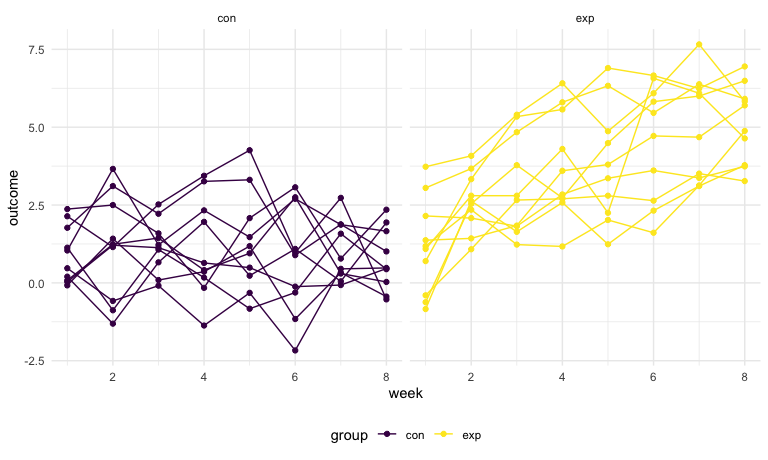
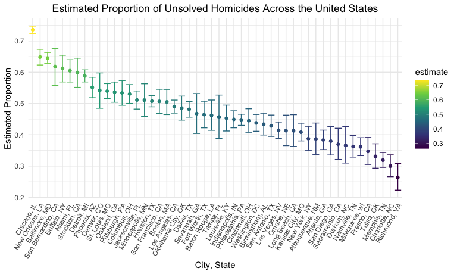
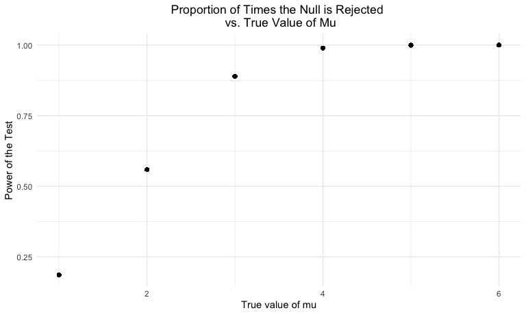
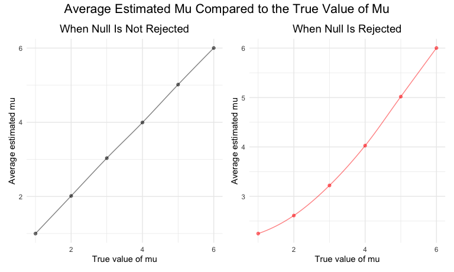

Homework 5
================
Emma Sexton <br>
Due 16 November 2022

## Problem 1

### Import data using `list.files`

``` r
longitudinal_study_df =
  tibble(
    file_names = list.files(path = "data/problem_1/", all.files = TRUE, no.. = TRUE),
    path = str_c("data/problem_1/", file_names)
  ) %>% 
  mutate(data = map(path, read_csv)) %>% 
  unnest(cols = c(data))
```

### Tidy data

``` r
tidy_longitudinal_df = 
  longitudinal_study_df %>% 
  mutate(
    files = str_replace(file_names, ".csv", ""),
    group = str_sub(files, 1, 3)) %>% 
  pivot_longer(
    week_1:week_8,
    names_to = "week",
    values_to = "outcome",
    names_prefix = "week_") %>% 
  mutate(week = as.numeric(week)) %>%
  select(group, subject = files, week, outcome)
```

### Plot showing observations on each subject over time

``` r
tidy_longitudinal_df %>% 
  ggplot(aes(x = week, y = outcome, group = subject, color = group)) + 
  geom_point() + 
  geom_path() + 
  facet_grid(~group)
```



There appears to be a positive trend in the experimental group where
outcome values increase as time passes. This trend is not observed or is
not as apparent in the control group. Additionally, the values in Week 8
are higher in the experimental group compared to the control, while
values were similar in both groups in Week 1.

## Problem 2

### Importing and describing the data

``` r
homicide_df <- 
  read_csv(
    'data/problem_2/homicide-data.csv') %>%  
  janitor::clean_names()

skimr::skim(homicide_df)
```

|                                                  |             |
|:-------------------------------------------------|:------------|
| Name                                             | homicide_df |
| Number of rows                                   | 52179       |
| Number of columns                                | 12          |
| \_\_\_\_\_\_\_\_\_\_\_\_\_\_\_\_\_\_\_\_\_\_\_   |             |
| Column type frequency:                           |             |
| character                                        | 9           |
| numeric                                          | 3           |
| \_\_\_\_\_\_\_\_\_\_\_\_\_\_\_\_\_\_\_\_\_\_\_\_ |             |
| Group variables                                  | None        |

Data summary

**Variable type: character**

| skim_variable | n_missing | complete_rate | min | max | empty | n_unique | whitespace |
|:--------------|----------:|--------------:|----:|----:|------:|---------:|-----------:|
| uid           |         0 |             1 |   9 |  10 |     0 |    52179 |          0 |
| victim_last   |         0 |             1 |   1 |  20 |     0 |    12687 |          0 |
| victim_first  |         0 |             1 |   1 |  28 |     0 |    16640 |          0 |
| victim_race   |         0 |             1 |   5 |   8 |     0 |        6 |          0 |
| victim_age    |         0 |             1 |   1 |   7 |     0 |      102 |          0 |
| victim_sex    |         0 |             1 |   4 |   7 |     0 |        3 |          0 |
| city          |         0 |             1 |   5 |  14 |     0 |       50 |          0 |
| state         |         0 |             1 |   2 |   2 |     0 |       28 |          0 |
| disposition   |         0 |             1 |  14 |  21 |     0 |        3 |          0 |

**Variable type: numeric**

| skim_variable | n_missing | complete_rate |        mean |         sd |          p0 |         p25 |         p50 |         p75 |          p100 | hist  |
|:--------------|----------:|--------------:|------------:|-----------:|------------:|------------:|------------:|------------:|--------------:|:------|
| reported_date |         0 |             1 | 20130899.16 | 1123419.63 | 20070101.00 | 20100318.00 | 20121216.00 | 20150911.00 | 201511105\.00 | ▇▁▁▁▁ |
| lat           |        60 |             1 |       37.03 |       4.35 |       25.73 |       33.77 |       38.52 |       40.03 |         45.05 | ▁▅▅▇▅ |
| lon           |        60 |             1 |      -91.47 |      13.75 |     -122.51 |      -96.00 |      -87.71 |      -81.76 |        -71.01 | ▃▁▃▇▅ |

**Summary of Dataset**: The above dataset (`homicide_df`) consists of
52179 observations and 12 variables. The dataset details case
information, such as case ID (`uid`) and the date the homicide was
reported (`reported_date`). Additionally, information related to the
victim (`victim_last`, `victim_first`, `victim_race`, `victim_age`,
`victim_sex`) is detailed, as well as the location of the homicide
(`city`, `state`, `lat`, `lon`). Lastly, a categorical variable
(`disposition`) consists of three levels to detail the results of the
homicide (i.e., “Closed without arrest”, “Closed with arrest”, and
“Open/No arrest”).

There is no missing data except for 60 missing values in `lat` and 60
missing values in `lon`.

### Summarizing total number of homicides and number of unsolved homicides

To summarize the homicide data, we will generate a new variable
(`city_state`) and count the total number of homicides reported in each
city, as well as the number of unsolved homicides, determined by the
`disposition` variable (i.e., “Closed without arrest” or “Open/No
arrest”).

``` r
homicide_summary <- 
  homicide_df %>% 
  mutate(
    city_state = str_c(city, sep = ", ", state),
  ) %>% 
  group_by(city_state) %>% 
  summarise(
    n_homs = n(),
    n_unsolved = sum(disposition == "Closed without arrest" | disposition == "Open/No arrest")
  ) %>% 
  arrange(desc(n_homs))

homicide_summary %>% 
  knitr::kable(col.names = c("City, State", "Total Homicides (n)", "Unsolved Homicides(n)"))
```

| City, State        | Total Homicides (n) | Unsolved Homicides(n) |
|:-------------------|--------------------:|----------------------:|
| Chicago, IL        |                5535 |                  4073 |
| Philadelphia, PA   |                3037 |                  1360 |
| Houston, TX        |                2942 |                  1493 |
| Baltimore, MD      |                2827 |                  1825 |
| Detroit, MI        |                2519 |                  1482 |
| Los Angeles, CA    |                2257 |                  1106 |
| St. Louis, MO      |                1677 |                   905 |
| Dallas, TX         |                1567 |                   754 |
| Memphis, TN        |                1514 |                   483 |
| New Orleans, LA    |                1434 |                   930 |
| Las Vegas, NV      |                1381 |                   572 |
| Washington, DC     |                1345 |                   589 |
| Indianapolis, IN   |                1322 |                   594 |
| Kansas City, MO    |                1190 |                   486 |
| Jacksonville, FL   |                1168 |                   597 |
| Milwaukee, wI      |                1115 |                   403 |
| Columbus, OH       |                1084 |                   575 |
| Atlanta, GA        |                 973 |                   373 |
| Oakland, CA        |                 947 |                   508 |
| Phoenix, AZ        |                 914 |                   504 |
| San Antonio, TX    |                 833 |                   357 |
| Birmingham, AL     |                 800 |                   347 |
| Nashville, TN      |                 767 |                   278 |
| Miami, FL          |                 744 |                   450 |
| Cincinnati, OH     |                 694 |                   309 |
| Charlotte, NC      |                 687 |                   206 |
| Oklahoma City, OK  |                 672 |                   326 |
| San Francisco, CA  |                 663 |                   336 |
| Pittsburgh, PA     |                 631 |                   337 |
| New York, NY       |                 627 |                   243 |
| Boston, MA         |                 614 |                   310 |
| Tulsa, OK          |                 583 |                   193 |
| Louisville, KY     |                 576 |                   261 |
| Fort Worth, TX     |                 549 |                   255 |
| Buffalo, NY        |                 521 |                   319 |
| Fresno, CA         |                 487 |                   169 |
| San Diego, CA      |                 461 |                   175 |
| Stockton, CA       |                 444 |                   266 |
| Richmond, VA       |                 429 |                   113 |
| Baton Rouge, LA    |                 424 |                   196 |
| Omaha, NE          |                 409 |                   169 |
| Albuquerque, NM    |                 378 |                   146 |
| Long Beach, CA     |                 378 |                   156 |
| Sacramento, CA     |                 376 |                   139 |
| Minneapolis, MN    |                 366 |                   187 |
| Denver, CO         |                 312 |                   169 |
| Durham, NC         |                 276 |                   101 |
| San Bernardino, CA |                 275 |                   170 |
| Savannah, GA       |                 246 |                   115 |
| Tampa, FL          |                 208 |                    95 |
| Tulsa, AL          |                   1 |                     0 |

The above dataset (`homicide_summary`) details the total number of
homicides and the number of unsolved homicides that have occurred in
each city. Arranging the data based on the number of homicides
demonstrates that Chicago, IL, Philadelphia, PA, and Houston, TX have
the highest number of total homicides.

### Estimating proportions of unsolved homicides: Running `prop.test` for Baltimore, MD

``` r
baltimore_hom <-
  homicide_summary %>% 
  filter(city_state == "Baltimore, MD")

baltimore_prop <-
  prop.test(
    x = baltimore_hom$n_unsolved, 
    n = baltimore_hom$n_homs
  ) %>% 
  broom::tidy() %>% 
  select(estimate, starts_with("conf"))

baltimore_prop %>% 
  knitr::kable(digits = 3, 
               col.names = c("Estimate", "Lower CI", "Upper CI"))
```

| Estimate | Lower CI | Upper CI |
|---------:|---------:|---------:|
|    0.646 |    0.628 |    0.663 |

The above dataset (`baltimore_prop`) depicts the proportion of unsolved
homicides in Baltimore, MD in addition to the estimate’s upper and lower
limit of the 95% confidence interval. The proportion of unsolved
homicides in Baltimore is 0.646 (95% CI: 0.628-0.663).

### Estimating Proportions of unsolved homicides: Running `prop.test` by city

``` r
city_state_hom_prop <- homicide_summary %>% 
  mutate(
    results = map2(.x = homicide_summary$n_unsolved, 
                   .y = homicide_summary$n_homs, 
                   ~prop.test(x = .x, n = .y, conf.level = 0.95)),
    results = map(.x = results, 
                  ~broom::tidy(.x))
    ) %>% 
  unnest(results) %>% 
  select(city_state, estimate, starts_with("conf")) %>% 
  arrange(desc(estimate))

city_state_hom_prop %>% 
  knitr::kable(digits = 3, 
               col.names = c("City, State", "Estimate", "Lower CI", "Upper CI"))
```

| City, State        | Estimate | Lower CI | Upper CI |
|:-------------------|---------:|---------:|---------:|
| Chicago, IL        |    0.736 |    0.724 |    0.747 |
| New Orleans, LA    |    0.649 |    0.623 |    0.673 |
| Baltimore, MD      |    0.646 |    0.628 |    0.663 |
| San Bernardino, CA |    0.618 |    0.558 |    0.675 |
| Buffalo, NY        |    0.612 |    0.569 |    0.654 |
| Miami, FL          |    0.605 |    0.569 |    0.640 |
| Stockton, CA       |    0.599 |    0.552 |    0.645 |
| Detroit, MI        |    0.588 |    0.569 |    0.608 |
| Phoenix, AZ        |    0.551 |    0.518 |    0.584 |
| Denver, CO         |    0.542 |    0.485 |    0.598 |
| St. Louis, MO      |    0.540 |    0.515 |    0.564 |
| Oakland, CA        |    0.536 |    0.504 |    0.569 |
| Pittsburgh, PA     |    0.534 |    0.494 |    0.573 |
| Columbus, OH       |    0.530 |    0.500 |    0.560 |
| Jacksonville, FL   |    0.511 |    0.482 |    0.540 |
| Minneapolis, MN    |    0.511 |    0.459 |    0.563 |
| Houston, TX        |    0.507 |    0.489 |    0.526 |
| San Francisco, CA  |    0.507 |    0.468 |    0.545 |
| Boston, MA         |    0.505 |    0.465 |    0.545 |
| Los Angeles, CA    |    0.490 |    0.469 |    0.511 |
| Oklahoma City, OK  |    0.485 |    0.447 |    0.524 |
| Dallas, TX         |    0.481 |    0.456 |    0.506 |
| Savannah, GA       |    0.467 |    0.404 |    0.532 |
| Fort Worth, TX     |    0.464 |    0.422 |    0.507 |
| Baton Rouge, LA    |    0.462 |    0.414 |    0.511 |
| Tampa, FL          |    0.457 |    0.388 |    0.527 |
| Louisville, KY     |    0.453 |    0.412 |    0.495 |
| Indianapolis, IN   |    0.449 |    0.422 |    0.477 |
| Philadelphia, PA   |    0.448 |    0.430 |    0.466 |
| Cincinnati, OH     |    0.445 |    0.408 |    0.483 |
| Washington, DC     |    0.438 |    0.411 |    0.465 |
| Birmingham, AL     |    0.434 |    0.399 |    0.469 |
| San Antonio, TX    |    0.429 |    0.395 |    0.463 |
| Las Vegas, NV      |    0.414 |    0.388 |    0.441 |
| Omaha, NE          |    0.413 |    0.365 |    0.463 |
| Long Beach, CA     |    0.413 |    0.363 |    0.464 |
| Kansas City, MO    |    0.408 |    0.380 |    0.437 |
| New York, NY       |    0.388 |    0.349 |    0.427 |
| Albuquerque, NM    |    0.386 |    0.337 |    0.438 |
| Atlanta, GA        |    0.383 |    0.353 |    0.415 |
| San Diego, CA      |    0.380 |    0.335 |    0.426 |
| Sacramento, CA     |    0.370 |    0.321 |    0.421 |
| Durham, NC         |    0.366 |    0.310 |    0.426 |
| Nashville, TN      |    0.362 |    0.329 |    0.398 |
| Milwaukee, wI      |    0.361 |    0.333 |    0.391 |
| Fresno, CA         |    0.347 |    0.305 |    0.391 |
| Tulsa, OK          |    0.331 |    0.293 |    0.371 |
| Memphis, TN        |    0.319 |    0.296 |    0.343 |
| Charlotte, NC      |    0.300 |    0.266 |    0.336 |
| Richmond, VA       |    0.263 |    0.223 |    0.308 |
| Tulsa, AL          |    0.000 |    0.000 |    0.945 |

The above dataset (`city_state_hom_prop`) depicts the estimated
proportion of unsolved homicides, as well as each estimate’s 95%
confidence interval for each city. By arranging the dataset in
descending order, it is apparent that Chicago, IL has the highest
proportion of unsolved homicides, followed by New Orleans, LA and
Baltimore, MD.

### Plot of unsolved homicide proportions and confidence intervals by city

``` r
city_state_hom_prop %>% 
  mutate(
    city_state = fct_reorder(city_state, -estimate)
  ) %>% 
  ggplot(aes(x = city_state, y = estimate, color = estimate)) +
  geom_point() +
  geom_errorbar(aes(ymin = conf.low, ymax = conf.high)) +
  labs(
    title = "Estimated Proportion of Unsolved Homicides Across the United States",
    x = "City, State",
    y = "Estimated Proportion"
  ) + 
  theme(plot.title = element_text(hjust = 0.5),
        axis.text.x = element_text(angle = 60, hjust = 1),
        legend.title = element_blank())
```



The above plot demonstrates the estimated proportion of unsolved
homicides in each city, with its corresponding confidence interval
demonstrated using error bars. As noted in previous analyses, Chicago,
IL has the highest proportion of unsolved homicides, while Tulsa, AL has
the lowest proportion. Of note, Tulsa, AL only has one reported
homicide, and therefore the Chi-Squared approximation calculated using
`prop.test` may not be accurate.

## Problem 3

### Conducting a simulation to explore power in a one-sample t-test

First, we need to set the following design elements:

``` r
sim_model <- function(sample_n = 30, mu, sigma = 5) {

  model_df =
    tibble(
      x = rnorm(n = sample_n, mean = mu, sd = sigma),
    )

  model_df %>%
    t.test(., conf.level = 0.95) %>%
    broom::tidy() %>%
    select(estimate, p.value)

}

problem_3_df <-
  5000 %>%
  rerun(sim_model(mu = 0))
```

The above dataframe consists of 5000 datasets, where each list contains
the estimate value and the p-value for that dataset when **mu = 0**.

Next, we’ll repeat this when mu = {1 ,2, 3, 4, 5, 6}:

``` r
mu_list =
  list(
    "mu = 1" = 1,
    "mu = 2" = 2,
    "mu = 3" = 3,
    "mu = 4" = 4,
    "mu = 5" = 5,
    "mu = 6" = 6
  )

results = vector("list", length = 6)

results[[1]] = sim_model(mu = mu_list[[1]])

for (i in 1:6) {

  results[[i]] = 
    rerun(5000, sim_model(mu = mu_list[[i]])) %>% 
    bind_rows()

}

problem_3_df <- results %>% 
  tibble(
    results
  ) %>% 
  mutate(
    mu = c(1, 2, 3, 4, 5, 6)
  ) %>% 
  unnest(results) %>% 
  select(mu, estimate, p.value)
```

### Plot showing the proportion of times the null was rejected

``` r
problem_3_df %>%
  mutate(
    null_rejected = ifelse(p.value < 0.05, 1, 0)
  ) %>% 
  group_by(mu) %>%
  mutate(
    power = mean(null_rejected)
  ) %>% 
  ggplot(aes(x = mu, y = power)) + 
  geom_point() +
  geom_smooth() + 
  labs(
    title = "Proportion of Times the Null is Rejected (Power of the Test) vs. ",
    x = "True value of mu",
    y = "Power of the Test"
  )
```

    ## `geom_smooth()` using method = 'gam' and formula 'y ~ s(x, bs = "cs")'



**Association Statement**: As the true value of mu (effect size)
increases, the proportion of times the null is rejected (power of the
test) also increases.

### Plot comparing the average estimate of mu and the true value of mu

``` r
avg_v_true <- problem_3_df %>%
  group_by(mu) %>% 
  summarize(avg_mu = mean(estimate)) %>% 
  ggplot(aes(x = mu, y = avg_mu)) +
  geom_point(alpha = 0.5, color = "black") +
  stat_smooth(geom = 'line', alpha = 0.5, color = "black") +
  labs(
    title = "When Null Is Not Rejected",
    x = "True value of mu",
    y = "Average estimated mu"
  ) +
  theme(plot.title = element_text(size = 14, hjust = 0.5))

avg_v_true_rejected = problem_3_df %>%
  filter(p.value < 0.05) %>% 
  group_by(mu) %>% 
  summarize(avg_mu = mean(estimate)) %>% 
  ggplot(aes(x = mu, y = avg_mu)) +
  geom_point(alpha = 0.5, color = "red",
             show.legend = TRUE) +
  stat_smooth(geom = 'line', alpha = 0.5, color = "red") +
  labs(
    title = "When Null Is Rejected",
    x = "True value of mu",
    y = "Average estimated mu"
  ) +
  theme(plot.title = element_text(size = 14, hjust = 0.5))

avg_v_true + avg_v_true_rejected +
  plot_annotation(
    title = "Average Estimated Mu Compared to the True Value of Mu",
    theme = theme(plot.title = element_text(size = 16, hjust = 0.5))
  )
```

    ## `geom_smooth()` using method = 'loess' and formula 'y ~ x'
    ## `geom_smooth()` using method = 'loess' and formula 'y ~ x'



The sample average of mu across tests for which the null is rejected is
approximately equal to the true value, particularly as effect size
increases.
